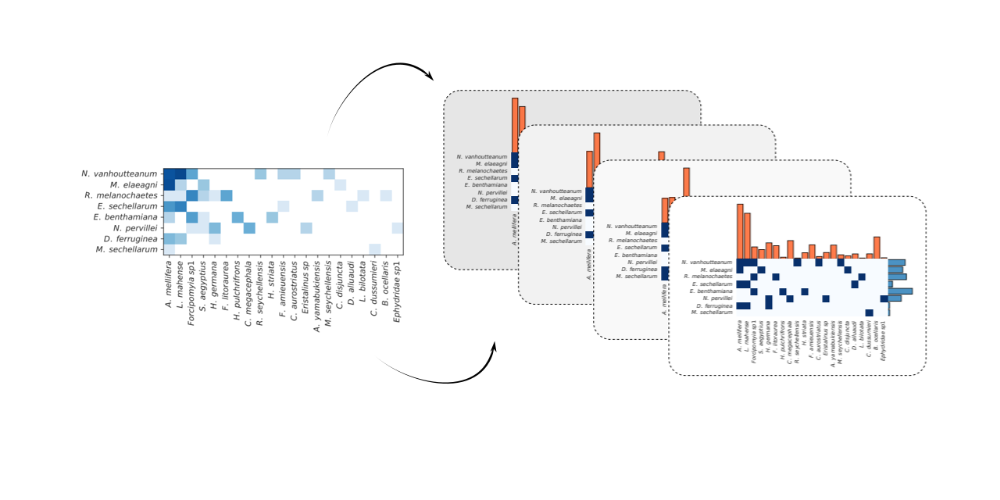

# plant-pollinator-inference 

Code for "[Reconstruction of plant--pollinator networks from observational data](https://www.biorxiv.org/content/10.1101/754077v1)", implemented in [Stan](http://mc-stan.org), with an emphasis on the `pystan` interface.


Pull requests with code for other Stan interfaces are more than welcomed!




## Dependencies

The only necessary dependency is `stan`. 
Our model will of course work with any [stan interface](https://mc-stan.org/users/interfaces/index.html), but we provide a number of utilities geared toward its use with [`pystan`](https://pypi.org/project/pystan/), the main python interface.

To install pystan, simply run:

    pip install pystan


## Quickstart

[Our model](model.stan) takes a matrix of observations `M` as input (matrix of non-negative integers, whose entries are number of observed interactions for each pair of plants and pollinators), and outputs a tensor `Q` where `Q[k,i,j]`, is the probability that the pair (i,j) is connected in sample `k` of the posterior distribution. A connection probability for pair (i,j) can be obtained by averaging over all samples. The program also generates samples for non-network quantities such as connectance, species abundances and the strength of the pollination preference.

For those familiar with `pystan`, running the model is as simple as:

```python
import pystan
import numpy as np
# Compile the model
model = pystan.StanModel(`model.stan`, model_name="plant_pol")
# Load data matrix
M = np.loadtxt('example_matrix.txt')
# Generate samples
samples = model.sampling(data={'M': M, 'n_p': M.shape[0], 'n_a': M.shape[1]})
# Calculate estimates
print("Connection probability for all pairs:", np.mean(samples['Q'], axis=0)
print("Average posterior connectance:", np.mean(samples['rho'], axis=0)))
```

In this snippet,  `n_p` and `n_a` are the dimension of the observation matrix `M`.
The observation matrix is thus a `n_p * n_a` numpy array of integers.

For those unfamiliar with Stan, we have written [a short tutorial](python_example.ipynb), as well as two python modules that abstract away most of the complexity associated with manipulating samples.

## Paper

If you use this code, please consider citing:

"[*Reconstruction of plant–pollinator networks from observational data*](https://www.biorxiv.org/content/10.1101/754077v1)"<br/>
[J.-G. Young](http://jgyoung.ca), [F. S. Valdovinos](https://www.fsvaldovinos.com) and [M.E.J. Newman](http://www-personal.umich.edu/~mejn/)<br/>
bioRxiv:754077 (2019) <br/>

## Author information

Code by [Jean-Gabriel Young](https://www.jgyoung.ca). Don't hesitate to get in touch at <jean.gabriel.young@gmail.com>, or via the [issues](https://github.com/jg-you/plant-pollinator-inference/issues)!
